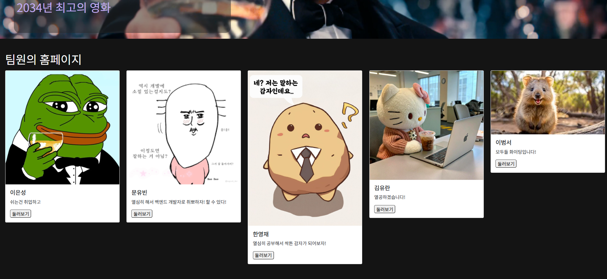
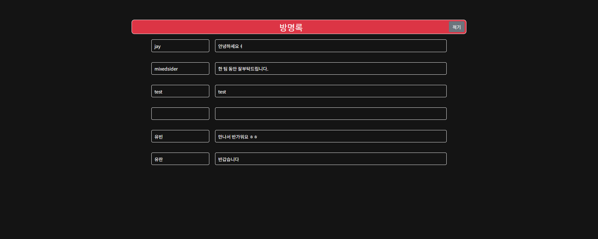

# [ABOUT PRIME]

URL :   
> **PRIME을 소개합니다!**

---

## 📚 목차
1. [프로젝트 소개](#-프로젝트-소개)
2. [기능](#-기능)
3. [기술 스택](#-기술-스택)
4. [설치 및 실행 방법](#-설치-및-실행-방법)
5. [팀원 소개](#-팀원-소개)
6. [담당 업무](#-담당-업무)
7. [기여 방법](#-기여-방법)
8. [스크린샷](#-스크린샷)


---

## 📖 프로젝트 소개

- 프로젝트 목적: 스파르타 내일배움캠프 온보딩 첫주차 팀 소개 페이지를 구현했습니다. 
- 핵심 목표: PRIME 팀 소개를 볼 수 있는 메인페이지와 각 팀원들의 소개를 볼 수 있는 팀원별 개인페이지 구현입니다.  
- 

---

## ✨ 기능

- **핵심 기능 1**: 팀 & 팀원 소개 기능
- **핵심 기능 2**: 메인페이지 방명록 기능
- **핵심 기능 3**: 메인페이지에서 개인페이지 연결 기능

---

## ⚙️ 기술 스택

- **프론트엔드**: HTML/CSS, Javascript
- **백엔드**: 
- **데이터베이스**: Firebase/Firestore
- **기타**: GitHub, GitHub Pages

---

## 🚀 설치 및 실행 방법

### 1. 프로젝트 클론
```bash
git clone https://github.com/your-repo.git
cd your-repo
```

## 🧑‍🤝‍🧑 팀원 소개

| 이름   | 역할              | GitHub                                  |
|--------|-------------------|-----------------------------------------|
| 이은성  | 팀장   | [GitHub Link](https://github.com/polaris65b) |
|  김유란 | 팀원   | [GitHub Link](https://github.com/yoorkim) |
| 문유빈  | 팀원       | [GitHub Link](https://github.com/YUBIN-githubb) |
| 이범서  | 팀원 | [GitHub Link](https://github.com/mixedsider) |
| 한영재  | 팀원 | [GitHub Link](https://github.com/han077han) |

---


## ⌨️ 담당 업무

| 팀원       | 담당업무                   | 세부내용                              |
|------------|----------------------------|---------------------------------------|
| 은성   | 메인페이지 구현 & 개인페이지 구현            | 메인페이지 & 개인페이지 HTML 구현 및 개인페이지 구현  |
| 유란   | 메인페이지 구현 & 개인페이지 구현                | 메인페이지 방명록 데이터베이스 연동 및 개인페이지 구현           |
| 유빈   | 형상 관리 & 개인페이지 구현 & 시연영상 촬영   | 버전,브랜치 관리 및 개인페이지 구현        |
| 범서   | 메인페이지 구현 & 개인페이지 구현 | 메인 페이지 CSS 구현 및 개인페이지 구현                |
| 영재   | 메인페이지 구현 & 개인페이지 구현 | 메인페이지, 개인페이지 연동 구현 및 개인페이지 구현              |


---

## 🤝 기여 방법

1. 이 레포지토리를 클론합니다.
2. develop 브랜치로 이동합니다. (예: `git checkout develop`)
3. 변경 사항을 커밋합니다. (예: `git commit -m "Add 새로운 기능"`).
4. 브랜치를 원격 레포지토리에 푸시합니다. (예: `git push origin develop`)

---


## 📷 스크린샷

1. **메인 홈페이지 UI**
   

   

2. **방명록 기능 실행 화면**
   


